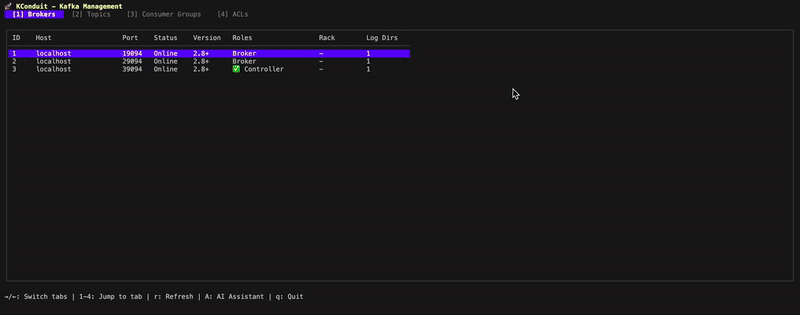

# KConduit

A powerful terminal UI for Apache Kafka with an AI-powered assistant for natural language operations. Built with Go and Charm's Bubble Tea framework for a beautiful, interactive experience.



## ✨ Features

### Core Functionality
- 🔌 **Multi-Broker Support** - Connect to Apache Kafka clusters with multiple brokers
- 📊 **Comprehensive Views** - Browse brokers, topics, consumer groups, and ACLs in tabbed interface
- 🎯 **Topic Management** - Create, configure, and delete topics with safety confirmations
- 📨 **Message Operations** - Produce and consume messages with formatted display
- ⚙️ **Configuration Editor** - View and modify topic configurations in real-time
- 👥 **Consumer Group Monitoring** - Track consumer groups with lag calculation
- 🔄 **Auto-Refresh** - Real-time updates of cluster state

### AI Assistant
- 🤖 **Natural Language Commands** - Interact with Kafka using plain English
- 🎯 **Multi-Provider Support** - OpenAI, Google Gemini, Anthropic Claude, and Ollama
- 🔄 **Batch Operations** - Modify all topics at once with a single command
- 📝 **Multi-Step Execution** - Execute complex operations in sequence
- 🔍 **Smart Queries** - Find topics and consumer groups based on various criteria

## 📦 Installation

### Using Go Install
```bash
go install github.com/axonops/kconduit/cmd/kconduit@latest
```

### Building from Source
```bash
git clone https://github.com/axonops/kconduit
cd kconduit
make build
```

## 🚀 Usage

### Basic Connection
```bash
# Connect to local Kafka (localhost:9092)
./kconduit

# Connect to specific brokers
./kconduit -b broker1:9092,broker2:9092

# With logging
./kconduit -b localhost:9092 --log-level debug --log-file kconduit.log
```

### AI Assistant Configuration
```bash
# Using OpenAI
export OPENAI_API_KEY="your-api-key"
./kconduit -b localhost:9092 --ai-engine openai --ai-model gpt-4

# Using Google Gemini
export GEMINI_API_KEY="your-api-key"
./kconduit -b localhost:9092 --ai-engine gemini --ai-model gemini-1.5-pro-latest

# Using Anthropic Claude
export ANTHROPIC_API_KEY="your-api-key"
./kconduit -b localhost:9092 --ai-engine anthropic --ai-model claude-3-opus-20240229

# Using Local Ollama
ollama serve  # In another terminal
./kconduit -b localhost:9092 --ai-engine ollama --ai-model llama2
```

## ⌨️ Keyboard Shortcuts

### Global Navigation
- `→/←` or `1-4` - Switch between tabs (Brokers, Topics, Consumer Groups, ACLs)
- `r` - Refresh current view
- `A` - Open AI Assistant
- `q` or `Ctrl+C` - Quit application

### Topics Tab
- `↑/↓` - Navigate through topics
- `Tab` - Switch between topic list and configuration panel
- `Enter` - Start consuming from selected topic
- `P` - Produce messages to selected topic
- `C` - Create new topic
- `D` - Delete selected topic (with confirmation)
- `e` - Edit topic configuration

### Consumer Mode
- `↑/↓` or `PgUp/PgDn` - Scroll through messages
- `c` - Clear message list
- `Esc` - Return to topic list

### Producer Mode
- `Tab` - Switch between key and value fields
- `Ctrl+S` - Send message
- `Esc` - Return to topic list

### Delete Topic Dialog
- `Type topic name` - Confirmation required
- `Tab` - Navigate between input and buttons
- `Enter` - Confirm deletion (only when name matches)
- `Esc` - Cancel deletion

## 🤖 AI Assistant Commands

### Topic Management
```
"Create a topic named events with 10 partitions and gzip compression"
"Change the partitions to 50 on topic user-events"
"Set retention to 7 days on orders topic"
"Delete topic test-topic"  // Not supported for safety
```

### Batch Operations (ALL Topics)
```
"Increase partitions to 100 on all topics"
"Set compression to lz4 on all topics"
"Change retention to 30 days for all topics"
```

### Topic Queries
```
"List topics with no compression"
"Find topics with more than 10 partitions"
"Show topics that contain 'events' in their name"
```

### Consumer Group Queries
```
"Find consumer groups with lag greater than 1000"
"List consumer groups that contain 'payment'"
"Show consumer groups in Stable state"
```

### Multi-Step Operations
```
"Change hello-topic to use lz4 compression and increase partitions to 100"
// This executes both operations in sequence
```

## 🔧 Configuration

### Environment Variables

| Variable | Description | Default |
|----------|-------------|---------|
| `KCONDUIT_BROKERS` | Kafka broker addresses | localhost:9092 |
| `KCONDUIT_LOG_LEVEL` | Log level (debug, info, warn, error) | info |
| `KCONDUIT_LOG_FILE` | Log file path | stderr |
| `OPENAI_API_KEY` | OpenAI API key for AI assistant | - |
| `OPENAI_MODEL` | OpenAI model to use | gpt-3.5-turbo |
| `GEMINI_API_KEY` | Google Gemini API key | - |
| `GEMINI_MODEL` | Gemini model to use | gemini-1.5-pro-latest |
| `ANTHROPIC_API_KEY` | Anthropic API key | - |
| `ANTHROPIC_MODEL` | Claude model to use | claude-3-haiku-20240307 |
| `OLLAMA_URL` | Ollama server URL | http://localhost:11434 |
| `OLLAMA_MODEL` | Ollama model to use | llama2 |

### Command Line Flags

| Flag | Description | Default |
|------|-------------|---------|
| `-b, --brokers` | Comma-separated list of Kafka brokers | localhost:9092 |
| `--log-level` | Log level (debug, info, warn, error) | info |
| `--log-file` | Log file path (empty for stderr) | - |
| `--ai-engine` | AI engine (openai, gemini, anthropic, ollama) | auto-detect |
| `--ai-model` | AI model to use | provider default |

## 🏗️ Building & Development

### Requirements
- Go 1.20+
- Access to a Kafka cluster

### Build Commands
```bash
# Build the binary
make build

# Run directly
make run

# Clean build artifacts
make clean

# Run with test Kafka cluster
docker-compose -f tests/docker-compose.yaml up -d
./kconduit -b localhost:19092
```

## 🔒 Safety Features

- **Topic Deletion Protection** - Requires typing exact topic name for confirmation
- **AI Safety** - AI Assistant cannot perform delete operations
- **Error Recovery** - Failed operations in batch don't stop other operations
- **Comprehensive Logging** - All operations logged for audit trail

## 📋 Supported Kafka Operations

### Topic Operations
- ✅ Create topics with custom configurations
- ✅ Modify topic partitions (increase only)
- ✅ Update topic configurations
- ✅ Delete topics (with confirmation)
- ✅ View all topic configurations
- ✅ Batch operations on all topics

### Message Operations
- ✅ Produce messages with key-value pairs
- ✅ Consume messages from any partition
- ✅ Format and display message headers
- ✅ Clear consumer display

### Consumer Group Operations
- ✅ List all consumer groups
- ✅ Calculate consumer lag per group
- ✅ View group members and state
- ✅ Query groups by various criteria

### Broker Operations
- ✅ List all brokers with status
- ✅ Identify active controller
- ✅ Display broker versions and roles
- ✅ Show rack information

## 🤝 Contributing

Contributions are welcome! Please feel free to submit a Pull Request.

## 📄 License

This project is licensed under the Apache License - see the LICENSE file for details.

## 🙏 Acknowledgments

- Built with [Bubble Tea](https://github.com/charmbracelet/bubbletea) by Charm
- Uses [Sarama](https://github.com/IBM/sarama) for Kafka operations
- AI providers: OpenAI, Google Gemini, Anthropic, and Ollama

## 📄 Legal Notices

*This project may contain trademarks or logos for projects, products, or services. Any use of third-party trademarks or logos are subject to those third-party's policies.*

- **Apache**, **Apache Kafka** and **Kafka** are either registered trademarks or trademarks of the Apache Software Foundation or its subsidiaries in Canada, the United States and/or other countries.
